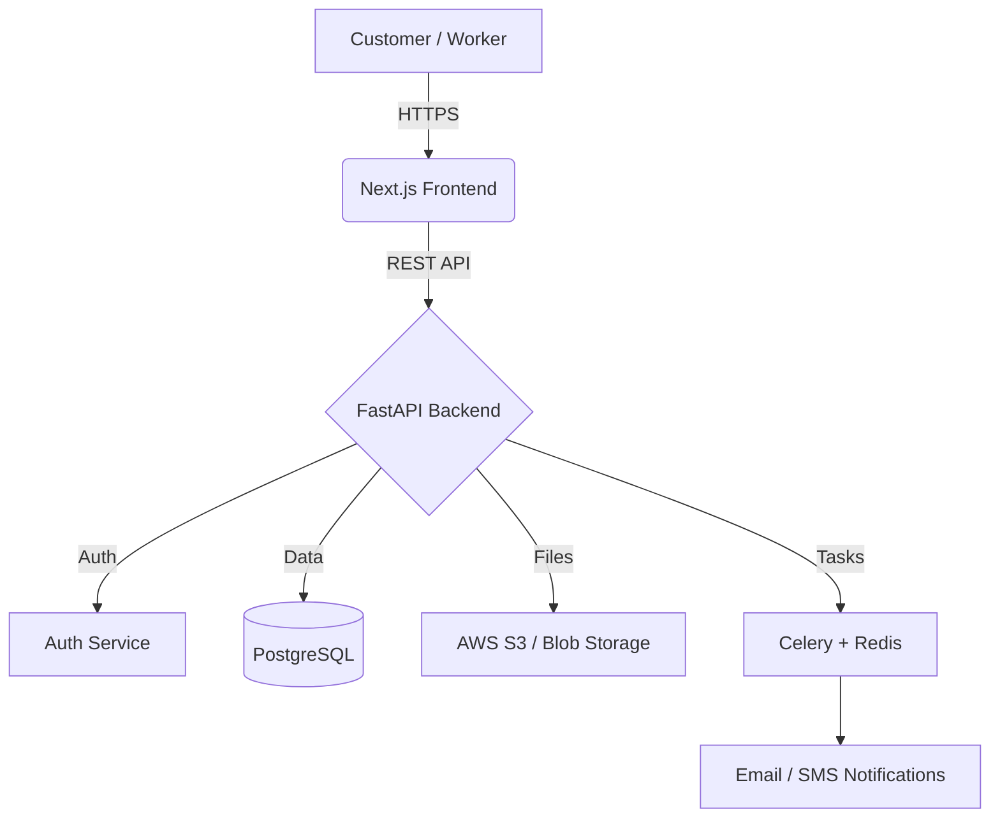

# Interior Design CRM Platform: Architecture & Feature Plan

This document outlines the architecture and feature set for the Avyron Studio Interior Design CRM Platform. It aligns your vision for a robust lead-generation and workforce-management system with the modern Next.js website structure we have already established.

## 1. Landing Page Structure (Current Website)

The landing page is designed to look premium, using white, charcoal, and gold/saffron accents, with a modern typography (font-heading). It is currently implemented as a modular Next.js page.

- **Hero Section**: Luxury interior design banner with a clear call-to-action ("Book Free Consultation").
- **Logo Ticker**: Social proof showing brands, partners, or media features.
- **Services**: Highlights of offerings (Complete Interior, Modular Kitchen, Wardrobe, False Ceiling, etc.).
- **Why Choose Us**: Value proposition and unique selling points.
- **Before / After**: Interactive sliders showing project transformations.
- **Portfolio**: Filterable gallery of Kitchens, Living Rooms, Bedrooms, Commercial spaces, and Videos.
- **How It Works**: Step-by-step process of how you execute projects.
- **Project Planner (Lead Generation)**: An interactive form (currently 4 steps, to be expanded).
- **Special Offer**: Time-sensitive promotions to drive conversions.
- **Testimonials & FAQ**: Customer reviews and frequently asked questions.
- **Contact Section**: Physical office details and direct contact form.
- **Final CTA**: A concluding push to encourage bookings.

## 2. Expanded Requirement Form (Project Planner)

The current `ProjectPlanner` component will be expanded into a comprehensive 9-step lead capture engine:

- **Step 1: Core Service**: Complete Interior, Interior Design Only, or Consultancy Only.
- **Step 2: Property Type**: Apartment, Villa, Office, Shop, Restaurant, Hotel.
- **Step 3: Location**: City, Address, Pincode, Google Maps integration.
- **Step 4: Project Scope**: Carpet Area, Built-up Area, Number of Rooms, Budget Range, Expected Start/Completion Dates.
- **Step 5: Required Work (Checkboxes)**: Modular Kitchen, Wardrobe, TV Unit, False Ceiling, Wallpaper, Painting, Tiles, Civil Work, Electrical, Plumbing, etc.
- **Step 6: Media Upload**: Floor Plan, Current Photos, Videos, Reference Images.
- **Step 7: Personal Details & Auth**: Name, Email, Phone, Address. Includes "Continue with Google" or "Mobile OTP" for seamless CRM entry.
- **Step 8: Meeting Preference**: Site Visit, Video Call, Phone Call, Office Visit.
- **Step 9: Submission**: Triggers CRM entry, sends estimated cost, and books consultation.

*(Note: Consultancy and Design-Only flows will be streamlined versions of this form).*

## 3. Worker Registration Portal (Future Expansion)

A dedicated portal for onboarding verified contractors and workers.

- **Worker Types**: Carpenter, Painter, Plumber, Electrician, Civil Contractor, Tile/Wallpaper Installer, etc.
- **Registration Form**:
  - **Personal & Experience**: Name, Mobile, Address, Experience, Current Salary/Wage, Availability.
  - **Skills**: Checkboxes for specific capabilities (e.g., Wardrobe, Kitchen, False Ceiling).
  - **Verification Uploads**: Aadhar, PAN, Driving License, Work Images/Videos, Certificates.
  - **References**: Previous employers and contact details.

## 4. Admin Dashboard (CRM & ERP)

A unified control center for your team to manage the business.

- **Dashboard Metrics**: Today's Leads, Conversion Rates, Revenue, Ongoing Projects, Available Workers.
- **Lead Management**: View, assign, and track status of new requirements.
- **Quotation Engine**: Auto-generate quotations based on user inputs (Area, Required Work) and send directly to clients.
- **Project Management**: Track active projects, assign workers, monitor timelines.
- **Worker & Contractor Management**: Verify new workers, view availability, track utilization.
- **Website CMS**: Manage Portfolio images, videos, and Testimonials directly from the dashboard.

## 5. Technology Stack & Architecture

The architecture separates the frontend presentation layer from the heavy backend CRM processing.

| Layer | Technology |
| :--- | :--- |
| **Frontend** | Next.js 14+ (React), TypeScript, Tailwind CSS, Framer Motion, Shadcn/UI |
| **Backend API** | Python FastAPI (High performance, excellent for background tasks & AI) |
| **Authentication**| NextAuth (Google OAuth) + Firebase/Twilio for Mobile OTP |
| **Database** | PostgreSQL (Managed via SQLAlchemy ORM) |
| **Storage** | AWS S3 or Azure Blob Storage (For portfolio media, user uploads, documents) |
| **Background Jobs**| Celery + Redis (For generating quotations, sending emails/SMS) |

### System Flow

## 6. Future Enhancements

As the platform grows, the architecture supports:
1. **Customer Portal**: For clients to track project progress, approve 3D renders, and make payments.
2. **Worker App**: A progressive web app (PWA) for workers to clock in, view daily tasks, and upload completion photos.
3. **AI Design Assistant**: Suggest interior styles based on user uploads and automatically estimate rough costs.
